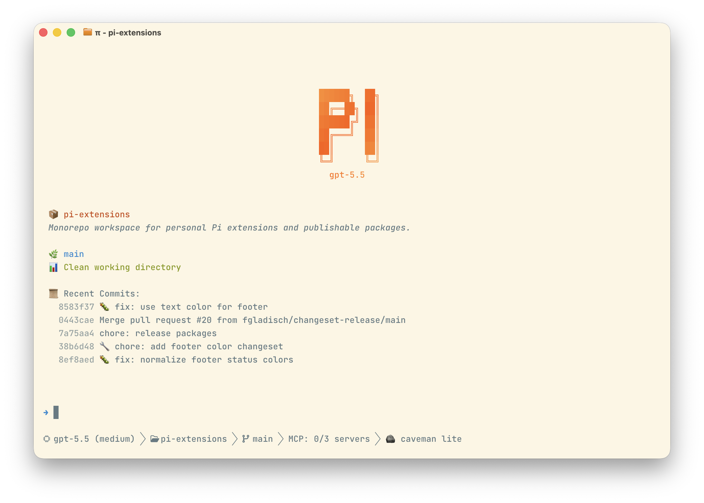

# pi-extensions

Monorepo for personal Pi extensions.

This root workspace holds shared tooling. Source-of-truth extension code
and full documentation live in `packages/`.

## Packages

- [`@fgladisch/pi-bash-approval`](packages/pi-bash-approval/README.md): Intercepts Pi bash calls and asks for approval unless a command matches your allow-list.
- [`@fgladisch/pi-caveman`](packages/pi-caveman/README.md): Injects an always-on caveman prompt style with switchable intensity levels.
- [`@fgladisch/pi-footer`](packages/pi-footer/README.md): Replaces Pi's footer with a configurable compact model, thinking, context usage, project, git branch, and extension status summary.
- [`@fgladisch/pi-user-select`](packages/pi-user-select/README.md): Adds a `user_select` tool so Pi can ask humans multiple-choice questions in workflow.
- [`@fgladisch/pi-persistent-history`](packages/pi-persistent-history/README.md): Persists prompt input history per project and preloads it for up/down recall across sessions.
- [`@fgladisch/pi-welcome-message`](packages/pi-welcome-message/README.md): Shows a configurable startup and `/new` workspace summary with package info, git status, useful resource links, and optional logo header.
- [`@fgladisch/pi-zsh-shell`](packages/pi-zsh-shell/README.md): Runs Pi user bash commands through zsh and sources Pi-specific functions from `~/.pi/agent/zsh-functions`.

## Development Layout

Each package keeps extension source under `packages/pi-*/extensions/`:

- `index.ts` is the Pi extension entrypoint.
- `utils.ts` (or `utils/*`) contains package-local helpers.
- `models/*.model.ts` contains package-local type aliases/models.
- `models/*.enum.ts` contains package-local enums.
- `models/index.ts` is the package-local barrel; extension files import models/enums from `./models`.

## Releasing (Changesets + CI + npm Trusted Publisher)

This repo publishes through GitHub Actions on `main` via `.github/workflows/release.yml`. npm authentication uses Trusted Publisher/OIDC, so no npm automation token is required.

1. Add a changeset for package changes:
   - `npm run changeset`
2. Commit and push to `main`.
3. CI runs lint/typecheck/test and `changesets/action`:
   - creates or updates release PR: `chore: release packages`
4. Merge release PR.
5. CI publishes to npm through Trusted Publisher.

### Notes

- Keep package versions source-controlled via changesets; do not manually bump versions for normal releases.
- If release job fails with `ENOENT .../packages/<pkg>/CHANGELOG.md`, add `CHANGELOG.md` to that package.
