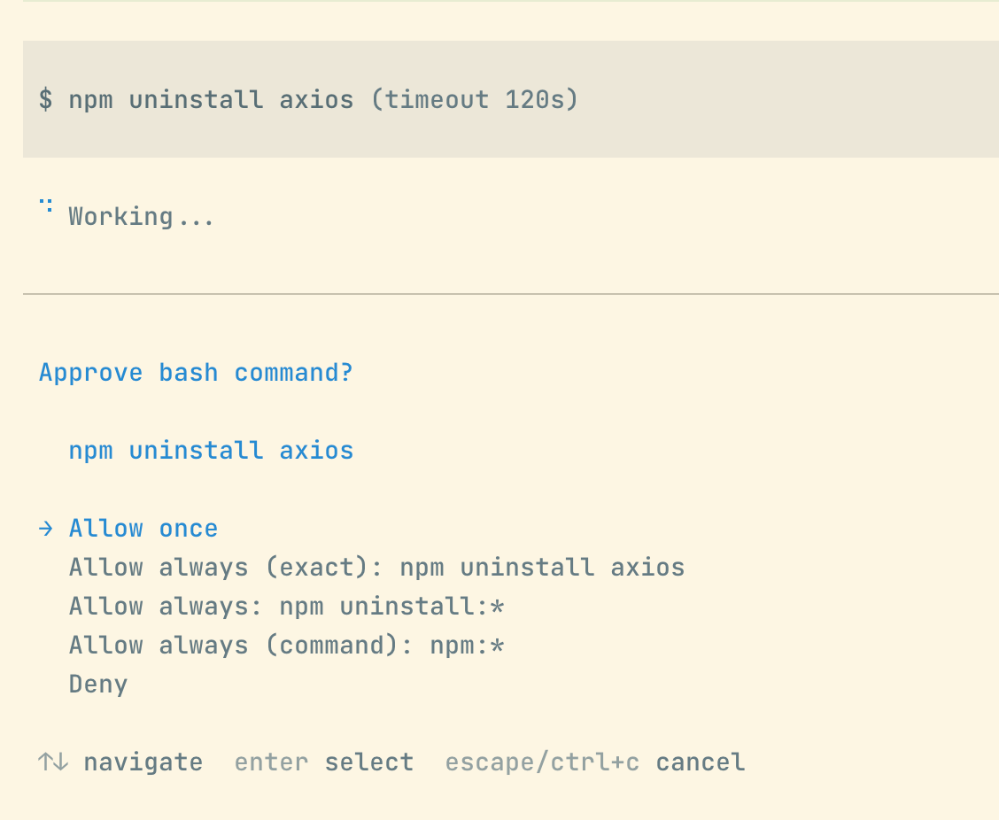

# pi-sandbox-bypass

Guards Pi `bash_full_permissions` behind an interactive allow-list. The normal
sandboxed `bash` tool is expected to be handled by a separate sandbox extension;
this package only decides when the model may use `bash_full_permissions` to
bypass that sandbox. In the tool UI it renders as `bash_fp: <command>` so you
can see the exact command being approved. Commands matching configured patterns
run silently, anything else prompts the user. In non-interactive contexts
(`pi -p`, no UI), unknown commands are blocked with a reason pointing at the
config file.



## Use in pi

Copy this package's `extensions/index.ts` into `~/.pi/agent/extensions/` (or
point pi at the package directory as a local prototype) so pi auto-discovers
it.

No npm publishing or install step is required for this prototype.

## Config

This extension reads two files:

1. **Global settings**: `~/.pi/agent/settings.json`
2. **Allow-list rules**: `~/.pi/agent/.bash-approval`

### Global settings (`settings.json`)

`splitChains` lives at `bashApproval.splitChains`:

```json
{
  "bashApproval": {
    "splitChains": true
  }
}
```

If missing/malformed, `splitChains` defaults to `true`.

### Allow-list rules (`.bash-approval`)

One rule per line:

```text
# bash approval allow-list
ls
ls:*
git status:*
npm test:*
```

Blank lines and `#` comment lines are ignored.

### Pattern syntax (`.bash-approval` lines)

| Pattern        | Matches                                            |
| -------------- | -------------------------------------------------- |
| `ls`           | exact: `ls` only                                   |
| `ls:*`         | `ls` exactly, or `ls <anything>` (space-separated) |
| `git status:*` | `git status` exactly, or `git status <anything>`   |
| `git*`         | trailing-`*` glob: any command starting with `git` |

`:*` form is recommended: requires exact match or trailing space, so
`git status:*` does **not** match `git statusfoo`. Bare `*` form is raw prefix
match. Use sparingly.

### `splitChains`

Default `true`: split incoming commands on shell separators (`&&`, `||`, `;`,
`|`, newline) and require **every** segment to match allow-list. Example:
`cd foo && git log` only runs unprompted when both segments are allow-listed.

Set `false` to match entire command string as one unit.

### Shell control filtering

When `splitChains` is `true`, shell control/declaration segments are ignored so
approval checks focus on actual commands:

- ignored heads include: `if`, `then`, `elif`, `else`, `for`, `do`, `done`,
  `fi`, `while`, `until`, `case`, `esac`, `function`
- condition tests (`[ ... ]`, `[[ ... ]]`, `test ...`) are ignored
- assignment-only segments like `FOO=bar` are ignored
- redirection-only segments like `> /tmp/out` after shell groups are ignored
- separators inside command substitutions like `$(git ls-files | sort)` are not
  treated as outer command-chain separators
- assignment prefixes before commands are stripped
  (for example: `FOO=bar npm test` evaluates as `npm test`)
- command substitutions inside assignment tokens are evaluated by their inner
  command, including assignment-only segments and assignment prefixes (for
  example: `tmp=$(mktemp -d /tmp/foo-XXXXXX)` evaluates as
  `mktemp -d /tmp/foo-XXXXXX`, and `FOO=$(./setup) npm test` checks both
  `./setup` and `npm test`)
- heredoc bodies are ignored during command splitting, so literal content inside
  substitutions such as `$(cat <<'EOF' ... EOF)` is not treated as executable
  command text

## Approval prompt

On non-matching command in interactive mode, user picks:

- **Allow once**: run this invocation, persist nothing.
- **Allow always (exact): `<command>`**: append literal command as new rule in
  `~/.pi/agent/.bash-approval` (truncated to 60 chars in label only). Hidden
  when exact command already on allow-list.
- **Allow always: `<prefix>:*`**: append suggested parameter-aware prefix rule.
  Suggestion uses first two tokens when present (`git status:*`,
  `npm install:*`, `mkdir -p:*`, `kubectl get:*`), otherwise first token
  (`ls:*`). Suggestion is derived from **first failing chain segment**, not
  head.
- **Allow always (command): `<command>:*`**: append command-only prefix rule
  using the first token of the first failing segment (`mkdir:*`, `git:*`,
  `npm:*`). Hidden when it would duplicate the parameter-aware suggestion.
- **Deny**: block with reason `Blocked by user`.

Selecting nothing (cancel) is treated as deny. "Allow always" choices persist
immediately to `~/.pi/agent/.bash-approval`.

## Slash commands

| Command                 | Action                                                                          |
| ----------------------- | ------------------------------------------------------------------------------- |
| `/bash-approval-reload` | Re-read `~/.pi/agent/.bash-approval` and `~/.pi/agent/settings.json` from disk. |
| `/bash-approval-list`   | Show currently allowed bash patterns.                                           |
